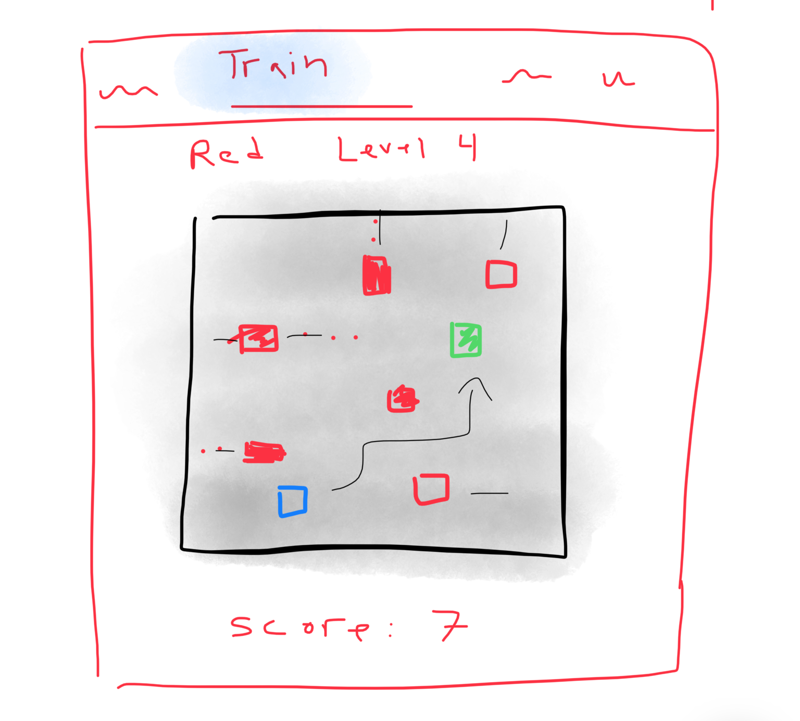
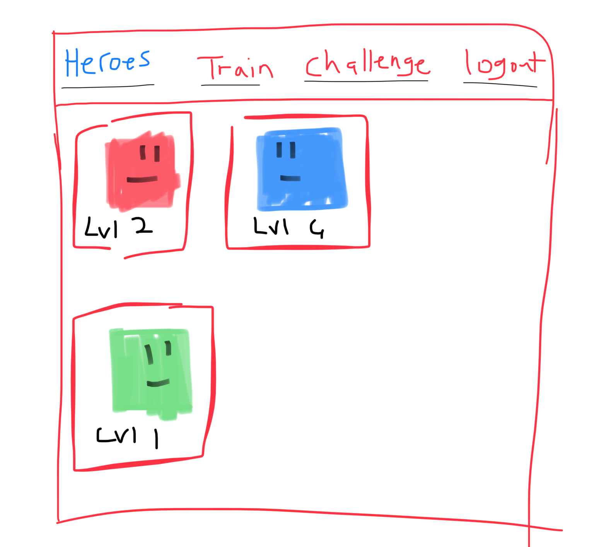
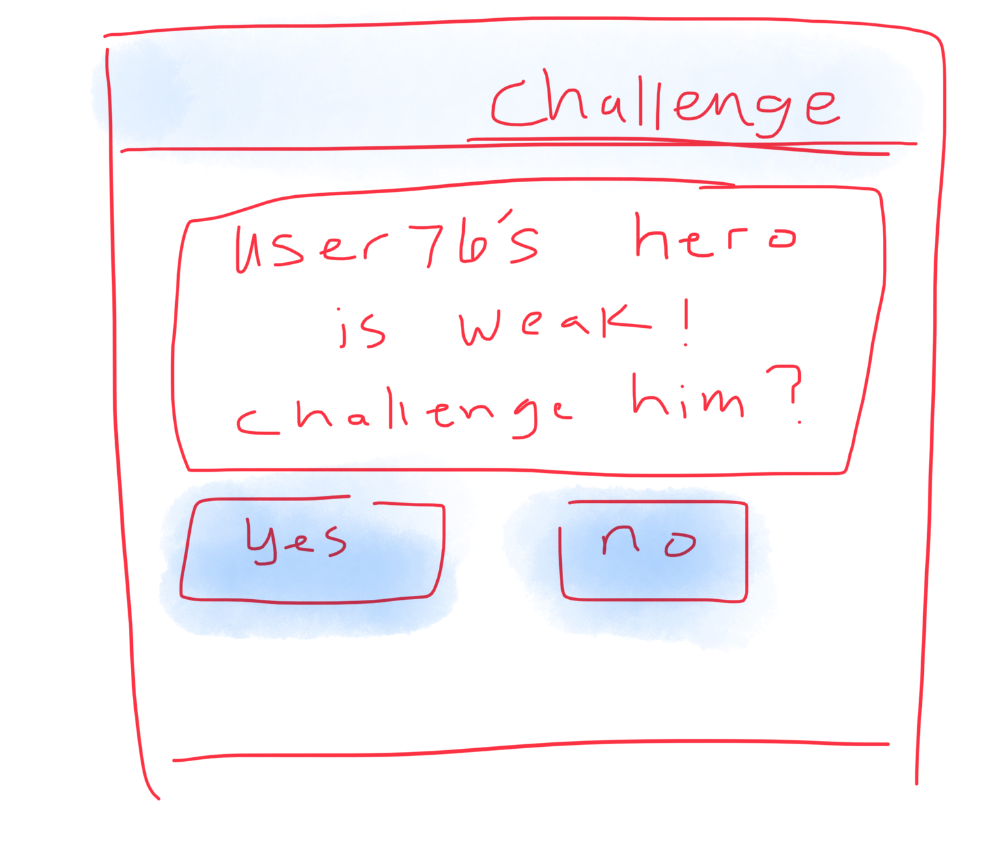

# Bit Hero
My CS260 Startup Project
created by Josh Burgoyne

Bit Hero is an arcade style game that is rendered on a 20 X 20 grid. The user controls a Hero on the screen and guides him towards a reward placed randomly on the grid. He must avoid being hit by dangerous hazards that are also moving on the grid. The player has three lives and the longer he plays, the harder the game gets. The player starts out with one Hero, but can level up and steal Heroes from other players. 

## Key Features:

+ Point system that keeps track of all players and their scores, and Heroes. 
+ Interaction between players.
+ Players can steal Heroes from other players.
+ Try to collect all the heroes. 

## Technologies:

#### **HTML, CSS, JavaScript:** 
The game will be rendered using HTML and CSS. There will be multiple pages including: Login, the main game page, my Heroes, and a page to see other players. The game logic uses JavaScript.

#### **Login Authentication:** 
Users will create accounts where they will keep track of their Heroes and scores. 

#### **Web Servers and Data Bases:**
 All user data will be stored on web servers.

#### **Web Sockets:** 
Users will be able to see other players scores. They will receive notifications about the status of other Players. Users can steal Heroes from other players and will be notified when they have that option.

# HTML Deliverable
Below is a summary of the html that makes up the structure of my startup website.

### 5 pages including: Login, My Heroes, Play, Scores, and Challenge.
### Login Authentication
The index.html page is the login page where the user will create a new account or sign into an existing account. User information will be stored on server database.
### Data base data
On the Scores page, there is a placeholder element in the middle that displays the top scores of all players. The data base will also keep track of each player's scores, heroes, and other data.
### Websockets
On the play.html page, on the left side, there is a placeholder element that will display real time info about other players who are currently playing.
On the scores.html page, on the left side, this placeholder element will notify the player when another player's character is vulnerable and can be challenged.
### Third Party Service Calls
On the Play.html page, an inspirational quote will be displayed after everytime the player loses a round. This quote will be fetched from a third party api.
### Other
I added images, buttons, links, headers, footers, and other elements necessary for the website.

